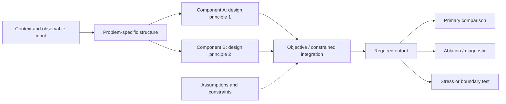

# Framework Figure

Use this reference after the task, gap, and core hypothesis are stable. Design a reasoning diagram first and a visual artifact second.

## Build the challenge-to-evidence map

Create this table before drawing:

| Challenge | Design principle | Component/procedure | Output or behavior | Paper claim | Validation hook |
|---|---|---|---|---|---|

Remove any component without a challenge or validation hook. Add missing links before adding visual detail.

## Use a selective architecture

Organize the figure as:

`context/input -> problem structure -> method components -> objective/constraints -> output -> evidence`

Use three visual bands when helpful:

1. **Problem and input:** research object, available observations, and challenge callouts.
2. **Proposed move:** design principles and only the components needed to explain the hypothesis.
3. **Outputs and evidence:** predicted outputs, evaluation settings, and claim-level tests.

Show training/design-only information separately from inference/deployment information. Distinguish data flow, supervision, constraints, and feedback with different arrow styles and include a legend when the distinction matters.

## Draft in Mermaid

Adapt this scaffold instead of copying it blindly:

Name nodes by semantic role, not internal code names. Put contribution labels only on genuinely differentiating steps.

## Write an editable visual specification

Specify:

- figure purpose and one-sentence takeaway;
- panels and reading order;
- exact node and arrow labels;
- group boundaries and visual hierarchy;
- challenge and contribution callouts;
- color semantics that remain readable in grayscale;
- caption draft and abbreviations;
- elements still provisional.

For a later PowerPoint handoff, request editable vector shapes, a consistent grid, grouped modules, and speaker-note provenance. Do not make `.pptx` generation mandatory for an idea that has not passed Checkpoint 3.

## Audit the figure

Confirm that a reader can infer the input, research difficulty, proposed principle, output, and decisive evidence without reading the paper. Reject circular arrows without a defined iterative process, unexplained icons, decorative complexity, tiny text, and modules that overstate what has been implemented.
